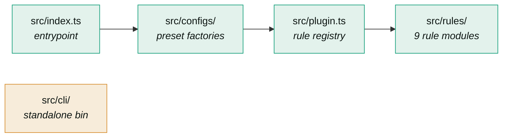
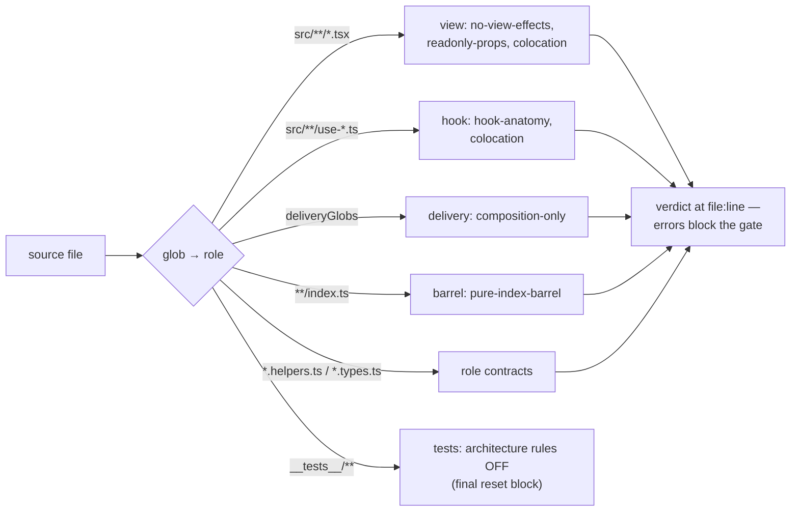
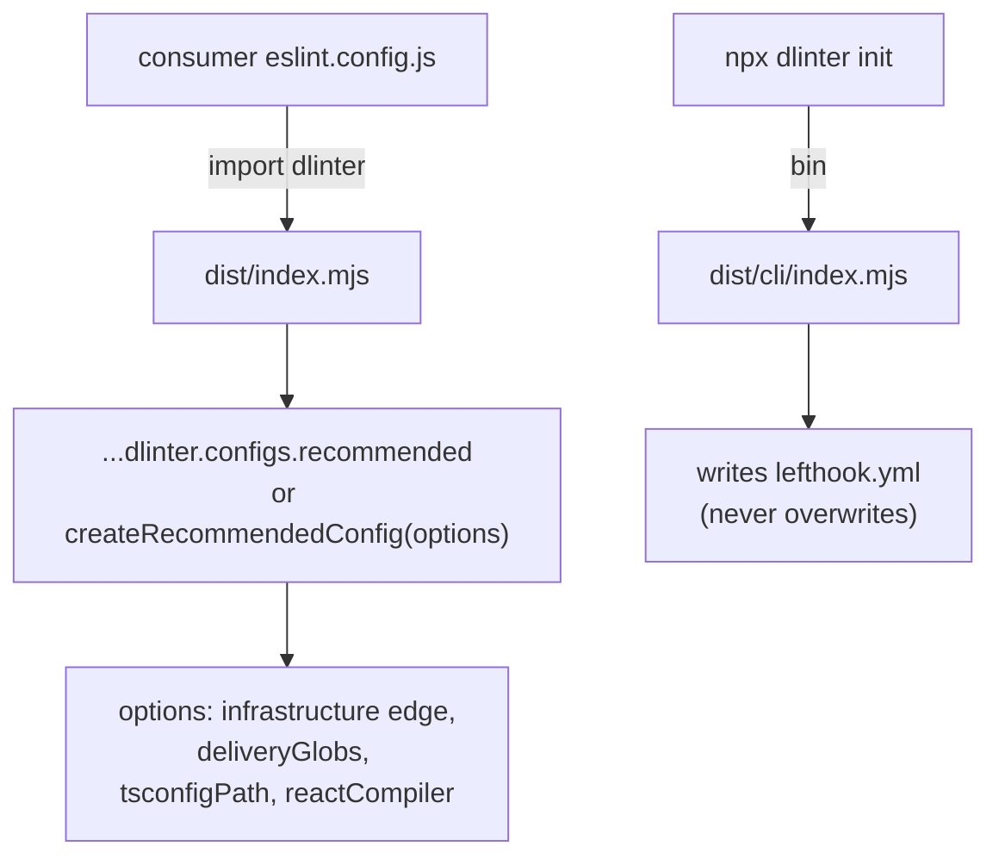
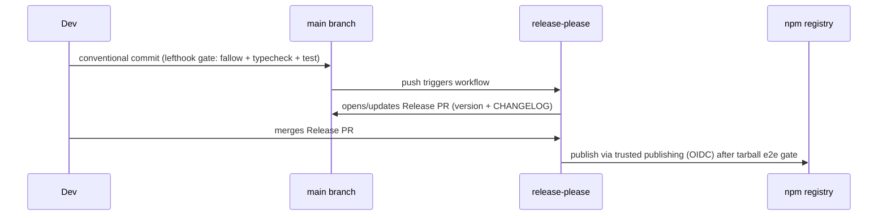

# Architecture

**The answer first**: this package is four layers with a one-way import direction, plus a standalone CLI bin. The layer contract is not documentation — it is enforced by `src/__tests__/self-governance.test.ts` via `no-restricted-imports` on every commit. If you wire an import against the arrow, the gate fails.

## Layer contract



| Layer | Owns | May import | Must never import |
|-------|------|------------|-------------------|
| `src/index.ts` | Public surface: default export (`plugin + configs`), `createRecommendedConfig`, option types | configs, plugin | cli |
| `src/configs/` | Preset factories (`recommended`, `dumb-ui`), severity constants, surgical overrides | plugin (`pluginBase`), third-party plugins | rules, cli, the entrypoint (module cycle) |
| `src/plugin.ts` | `pluginBase`: plugin metadata + rule map keyed by published rule name | rules | configs, cli, the entrypoint |
| `src/rules/` | The 9 rule modules — the leaf layer | node stdlib, `eslint` types, own role files | configs, plugin, cli, the entrypoint |
| `src/cli/` | `dlinter init` scaffolder (`bin` entry) | node stdlib, own role files | rules, configs, plugin, the entrypoint |

**Why configs receive `pluginBase` instead of importing rules**: config factories registering `plugins: { dlinter: pluginBase }` must not import the package entrypoint back (module cycle) nor reach into `src/rules/` directly (layer violation). `src/plugin.ts` exists precisely to be that seam.

## Module map

```text
src/
├── index.ts                    # composes presets; exports createRecommendedConfig
├── plugin.ts                   # pluginBase: meta + 9 rules keyed by published name
├── configs/
│   ├── dumb-ui.ts              # minimal preset: every .tsx is presentational
│   └── recommended/            # folder-owned module (its own governance applied)
│       ├── index.ts            # pure barrel
│       ├── recommended.ts      # the flat-config array factory (glob topology)
│       ├── recommended.constants.ts  # globs, upstream rule maps, surgical overrides
│       └── recommended.types.ts      # RecommendedConfigOptions
├── rules/                      # each rule folder-owned when split into role files
│   ├── strict-colocation/      # visitor built from a per-check fragment registry
│   ├── folder-ownership/       # reads the REAL filesystem (existsSync) for siblings
│   ├── hook-anatomy/
│   ├── no-view-effects/
│   ├── readonly-props/
│   ├── composition-only-delivery/
│   ├── no-infrastructure-in-view.ts   # single-file rules need no folder
│   ├── pure-index-barrel.ts
│   ├── require-exported-variable-jsdoc.ts
│   └── __tests__/              # RuleTester suites + __fixtures__/
├── cli/
│   ├── index.ts                # bin entry: `dlinter init`
│   └── init/                   # never overwrites an existing lefthook.yml
├── types/plugin-shims.d.ts     # module shims for plugins without types
└── __tests__/self-governance.test.ts  # the package lints itself
```

## Enforcement pipeline (how a consumer file gets a verdict)

The preset assigns every file a **role by glob** (ESLint flat-config `files`/`ignores`), then applies that role's contract. Roles are verified against reality: `folder-ownership` reads the actual filesystem, not naming promises.



**Block order matters**: `createRecommendedConfig` returns an ordered array; later blocks override earlier ones per rule. The final block is the test reset — tests stay exempt from architecture rules no matter what earlier blocks enabled. When adding a block, place it BEFORE the test reset unless it must apply to tests.

## The role-file system (applied to this repo itself)

Every file has one role; when a module splits into role files, the whole unit moves into a folder named after the module with a pure `index.ts`:

| File pattern | Role | Contract |
|--------------|------|----------|
| `<module>.ts` | Main module | Exports named functions; declarations live in role files |
| `<module>.constants.ts` | Constants | Only home for root-level constants |
| `<module>.helpers.ts` | Helpers | Functions only — no root constants, no inline types |
| `<module>.types.ts` | Type contract | Interfaces/aliases; `*Props` fields `readonly` |
| `index.ts` | Barrel | Pure re-exports only |

**Documented exceptions** (why the repo does not violate itself): rule modules are exported const objects (the ESLint plugin contract requires `Rule.RuleModule` objects, so `exported-const` is off repo-wide), and `src/index.ts` + `src/cli/index.ts` are package entrypoints (`main`, `bin`), not barrels.

## Consumer surface



Presets are named after **architecture concepts** (`recommended`, `dumb-ui`), never after consuming projects. Project specifics (a Wails bridge, a tRPC client) enter as `createRecommendedConfig` **options**, not new presets.

## CI and release flow



`fix:` → patch, `feat:` → minor, `feat!:`/`BREAKING CHANGE:` → major. Publishing is tokenless (OIDC trusted publisher bound to `release-please.yml`).
