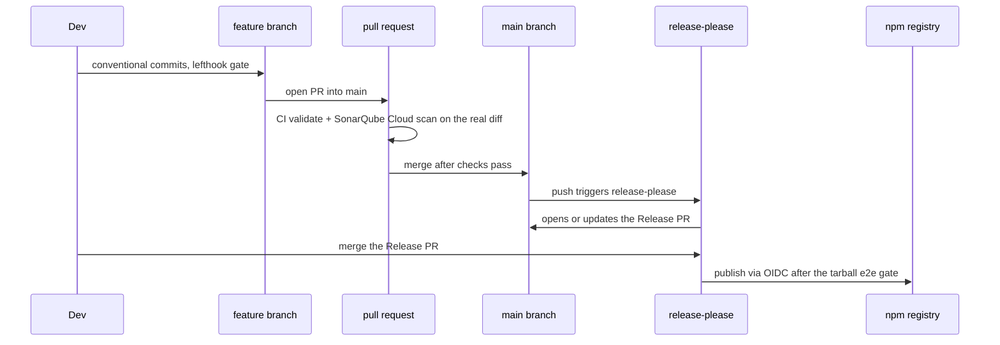

# CI, branch protection, and release flow

**The rule that governs everything here**: code reaches `main` through a
**feature branch and a pull request** — never a direct push. `main` is
protected; direct pushes are rejected for everyone, including the repo admin.
This is what makes CI and SonarCloud analyze *real code* on every change instead
of rubber-stamping trivial release commits.

## Why this exists (the failure it fixes)

Before this, feature code was pushed straight to `main`. The only pull requests
that ever opened were **release-please's Release PRs**, which touch exactly three
files: `.release-please-manifest.json`, `CHANGELOG.md`, `package.json`. And
SonarCloud, running in **Automatic Analysis** mode, only measures *new code —
the diff* on a PR. So the quality gate was analyzing version bumps and reporting
"0 New issues". It was theatre. Coverage read `0.0%` because nothing uploaded a
report.

The root cause was never release-please — a Release PR touching three files is
**correct** behaviour for a *release* PR. The disease was that feature code
skipped PRs entirely. Fix the code path and everything downstream (CI, Sonar,
review) starts seeing the actual change.

## The workflow

Release-please is **kept as-is**. It only ever *opens* PRs (it never
direct-pushes to `main`), so it lives happily behind branch protection. Merging
its Release PR still cuts the GitHub release and publishes to npm.

## Branch protection on `main`

Configured via the GitHub API (`repos/.../branches/main/protection`):

| Setting | Value | Why |
|---------|-------|-----|
| Require a pull request | on | No direct pushes |
| Required approvals | **0** | Solo maintainer — self-merge and Release-PR merge must work |
| Required status checks | `validate`, `SonarCloud Code Analysis` | Both the CI job **and** the SonarCloud quality gate must be green to merge |
| Enforce for admins | **on** | Direct push (and a red gate) rejected for *everyone*, admin included |
| Force pushes / deletions | off | `main` history is immutable |

**The SonarCloud gate is merge-blocking — not advisory.** `SonarCloud Code
Analysis` is a required status check, so a red quality gate (e.g. new-code
coverage below the 80% threshold) blocks the merge button for everyone, admins
included. This was added after a slice merged with new-code coverage at 75.5%
because only `validate` was required at the time — the scan ran and failed, but
nothing enforced it. Requiring the check closes that gap at the source.

Verify the gate before merging any PR — the check appears in the PR's checks
list, and the raw condition is queryable:
`curl -s "https://sonarcloud.io/api/qualitygates/project_status?projectKey=Disble_dlinter-ts-react&pullRequest=<N>"`
(status must be `OK`, not `ERROR`). Reproduce coverage locally with
`bun run test:coverage` (writes `coverage/lcov.info`; Sonar's 80% is on new code).

Scope note: the gate lives on **`main` only**, which is the correct boundary —
every path to `main` goes through a `main`-targeting PR, so everything that ships
is gated. Protecting feature branches to gate intermediate/stacked PRs adds
per-slice coverage friction (and breaks the force-push rebase flow) without
protecting the shipped artifact any further.

**Why 0 approvals**: with a single maintainer, requiring an approval locks you out
of your own repository — nobody (not even the release-please bot's PR) could ever
be approved. Zero required approvals keeps the PR gate while allowing self-merge.

**Emergency escape hatch**: if CI is wedged and a fix must land, temporarily
relax protection (`gh api -X DELETE repos/.../branches/main/protection`), push,
then re-apply. `enforce_admins: true` means there is no silent bypass — that is
the point.

## CI — what runs on every PR

`.github/workflows/ci.yml`, job `validate`:

| Step | Command | Note |
|------|---------|------|
| Checkout | `fetch-depth: 0` | Sonar needs full history for new-code + blame |
| Typecheck | `bun run typecheck` | |
| Test + coverage | `bun run test:coverage` | writes `coverage/lcov.info` (v8 provider) |
| Build | `bun run build` | |
| Tarball e2e | `bun run e2e:pack` | |
| Sonar scan | `SonarSource/sonarqube-scan-action@v5` | **self-skips when `SONAR_TOKEN` is unset** |

The Sonar step is guarded with `if: ${{ env.SONAR_TOKEN != '' }}`. This is
deliberate: it means branch protection can require `validate` **before** the
SonarCloud secret exists, without the gate wedging every merge. Once the secret
lands, the scan activates automatically.

## SonarCloud — CI-based analysis (not Automatic)

Analysis moved from **Automatic Analysis** (the GitHub App) to a **CI-based
scan** so it reads the real diff and ingests coverage.

Config lives in `sonar-project.properties`:

| Key | Purpose |
|-----|---------|
| `sonar.projectKey`, `sonar.organization` | **Verify against SonarCloud → project → Information** |
| `sonar.sources` / `sonar.tests` / `sonar.test.inclusions` | production code vs. tests |
| `sonar.javascript.lcov.reportPaths=coverage/lcov.info` | coverage ingestion |

> **Mutually exclusive.** SonarCloud rejects a CI scan while **Automatic
> Analysis** is still enabled (`You are running CI analysis while Automatic
> Analysis is enabled`). Automatic Analysis must be turned **off** in the
> SonarCloud project: **Administration → Analysis Method**.

### One-time setup checklist

1. **Disable Automatic Analysis** in SonarCloud (Administration → Analysis Method).
2. Add repo secret **`SONAR_TOKEN`** (generate in SonarCloud → My Account → Security).
3. **Verify** `sonar.projectKey` and `sonar.organization` in `sonar-project.properties`.

Until step 2 is done the Sonar step skips cleanly; `validate` stays green.

## Publishing

Unchanged. Tokenless via [npm trusted publishing](https://docs.npmjs.com/trusted-publishers/)
(OIDC), bound to `release-please.yml`. See [architecture.md § CI and release flow](./architecture.md#ci-and-release-flow).
