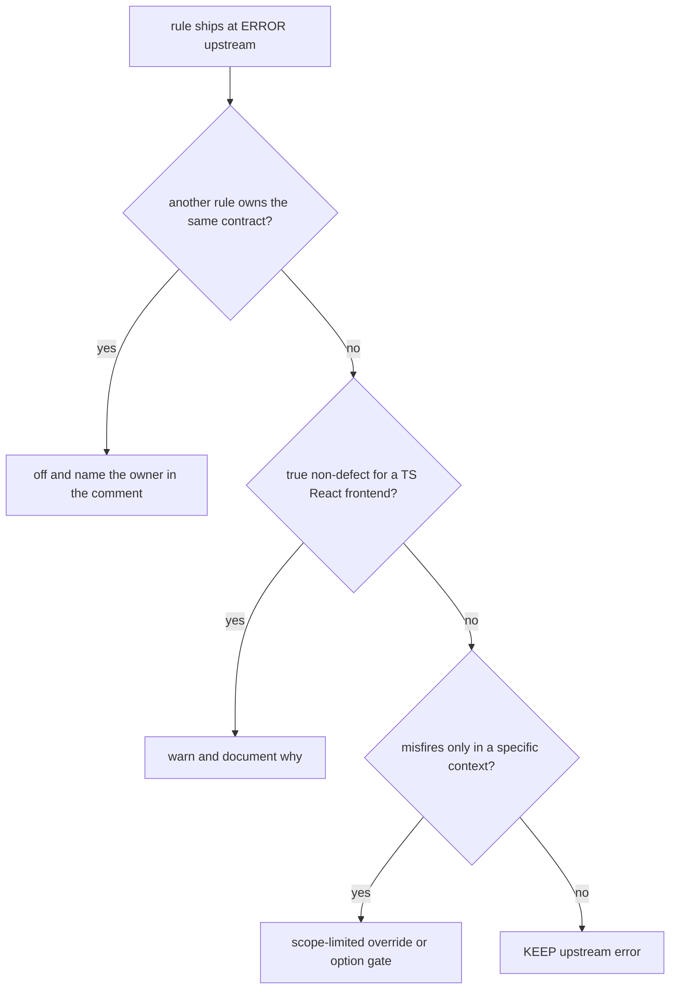
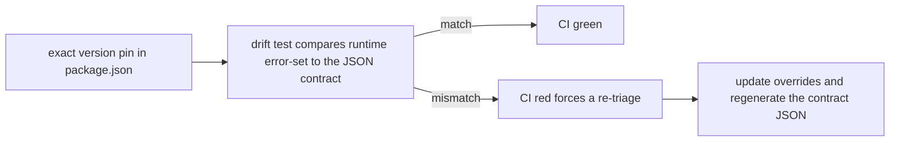

# Severity Policy — Upstream Triage Is Respected, Never Swept

**The answer first**: every bundled plugin whose recommended config this preset spreads keeps **its own author's per-rule severities, as-is**. Only *named* rule IDs are overridden, each with a documented reason in the source. Blanket-downgrading a plugin's ruleset (a `downgradeRuleSeverities`-style sweep) is the one anti-pattern this project was explicitly corrected away from — do not reintroduce it in any form.

## Why this policy exists

1. **The plugin author already triaged.** react-doctor ships 34 rules at `error` and ~198 at `warn`; sonarjs ships 206 at `error`. That per-rule judgment is exactly the "config archaeology" this package exists to do for consumers. A bulk sweep throws it away and re-labels definite bugs as advisory.
2. **External verdict parity.** Consumer projects are validated against **SonarQube Cloud** and audited with **Fallow**. A rule silenced locally but flagged in Cloud makes local green a lie. Severity decisions must keep local, Cloud, and Fallow verdicts aligned.
3. **Errors that lie get disabled.** The inverse failure: a gate that blocks on false positives teaches developers to `eslint-disable` it. So the *few* overrides that exist target rules that genuinely misfire — and nothing else.

## The decision procedure

Examples: `sonarjs/no-unused-vars` is off because `@typescript-eslint` owns the contract; `todo-tag` warns because tracked work is not a defect; the fake-credential rules are off in tests only; `react-compiler-no-manual-memoization` is gated behind the `reactCompiler` option. "It is a heuristic" and "awkward in JSX" do **not** qualify as reasons.

**What does NOT justify a downgrade** (rejected in review, recorded here so it stays rejected):
- "It's a threshold heuristic" — `cognitive-complexity` stays at upstream `error`; it keeps the ESLint gate aligned with the Fallow audit.
- "Duplication is sometimes intentional" — `no-identical-functions` stays at `error`; it aligns with Fallow dupes detection.
- "Nested ternaries are idiomatic in JSX" — `no-nested-conditional` stays at `error`; upstream's readability verdict stands.
- "Another rule overlaps partially" — `sonarjs/prefer-read-only-props` stays at `error` for SonarQube Cloud parity; it *coexists* with `dlinter/readonly-props` (verified complementary — see below).

## The override ledger (complete)

Everything the preset re-tunes from upstream. If a rule is not in this table, it runs at upstream severity.

### Production code

| Rule | Upstream | Preset | Reason |
|------|----------|--------|--------|
| `sonarjs/todo-tag`, `sonarjs/fixme-tag` | error | warn | TODOs/FIXMEs are tracked work, not defects; blocking commits on them teaches teams to delete the signal |
| `sonarjs/pseudo-random` | error | warn | Security hotspot, not a bug — `Math.random` is legitimate for non-crypto frontend uses |
| `sonarjs/no-unused-vars` | error | off | `@typescript-eslint/no-unused-vars` owns the contract with the `_`-ignore convention; the twin would flag what the convention permits |
| `no-undef` (core) | error | off | `tsc` owns undefined-symbol detection; ESLint's version false-positives on TS globals. The consumer's typecheck job is load-bearing |
| `no-redeclare` (core) | error | off | False-positives on TS function overloads and declaration merging |
| `import/*` (8 legacy IDs) | n/a | off | Neutralizes the legacy `eslint-plugin-import` namespace so consumers still loading it don't double-report what `import-x` owns |

### Test files only (`productionTestGlobs`)

| Rule | Preset in tests | Reason |
|------|-----------------|--------|
| `sonarjs/no-hardcoded-passwords`, `no-hardcoded-secrets`, `hardcoded-secret-signatures`, `no-hardcoded-ip` | off | Fixtures legitimately contain fake credentials. **Mirrors SonarQube Cloud**: files under `sonar.tests` get a reduced profile there, so local and Cloud verdicts stay aligned |
| all `dlinter/*`, `jsdoc/require-jsdoc` | off | Tests describe behavior, not shape (final reset block) |

Everything else in sonarjs stays ON in tests — `no-exclusive-tests`, `no-skipped-tests`, `no-empty-test-file` earn their keep exactly there.

### Option-gated

| Rule | Default | With option | Reason |
|------|---------|-------------|--------|
| `react-doctor/react-compiler-no-manual-memoization` | off | upstream severity via `createRecommendedConfig({ reactCompiler: true })` | Without the compiler, manual memoization is load-bearing and the rule misleads; with it, manual `useMemo`/`useCallback` is redundant noise |
| `dlinter/no-partial-package-mock`, `dlinter/no-test-timeout-overrides`, `dlinter/require-spy-restore` | off | `error` via `createRecommendedConfig({ vitestHygiene: true })` | Testing-hygiene category — see below |

### Testing hygiene: the first dlinter rules that APPLY to tests

Every other `dlinter/*` rule is architecture-only and stays exempt from
test files via the final reset block (`allDlinterRulesOff`). The
`vitestHygiene` option is a deliberate exception, mirroring sonarjs's
test-context carve-out style but in the opposite direction: instead of
turning rules OFF for tests, it turns three rules ON for tests, because the
contract they enforce (module-loader safety, timeout regression detection,
spy leak prevention) only makes sense inside test code and Vitest config
files. `dlinter/no-partial-package-mock` and `dlinter/require-spy-restore`
apply to `productionTestGlobs` only; `dlinter/no-test-timeout-overrides`
additionally applies to `vite.config.*`/`vitest.config.*`/`vitest.workspace.*`
(a raise-only check there, since Vitest's own defaults — `testTimeout: 5000`,
`hookTimeout: 10000` — are the regression-detector baseline). Default `false`:
zero behavior change for existing consumers until they opt in. The three rule
IDs are intentionally absent from `allDlinterRulesOff` — see the doc comment
on that constant in `recommended.constants.ts`.

### Options-tunes (severity unchanged — not downgrades)

- `@typescript-eslint/no-unused-vars` stays `error`; options add `argsIgnorePattern: '^_'`.
- `react-hooks/exhaustive-deps` is `warn` — that **matches upstream** (the plugin's own recommended config ships it at warn).

## The machinery that keeps it honest

| Piece | Location |
|-------|----------|
| Surgical overrides (with reason comments) | `src/configs/recommended/recommended.constants.ts` → `reactDoctorSurgicalOverrides`, `sonarjsSurgicalOverrides`, `sonarjsTestContextOverrides` |
| Drift guards | `src/configs/__tests__/upstream-severity-drift.test.ts` |
| Locked error-sets (JSON contracts) | `src/configs/__tests__/upstream-severity-contracts/` — react-doctor (34), sonarjs (206), typescript-eslint-recommended (20), typescript-eslint-type-checked-only (23) |
| Exact pins | `package.json` → `eslint-plugin-react-doctor`, `eslint-plugin-sonarjs`, `@typescript-eslint/*` |
| Behavioral proof | `src/configs/__tests__/recommended.test.ts` (virtual files) + `recommended-typed.test.ts` (typed fixture project) |

## Plugin bump playbook

When you bump a spread plugin and `upstream-severity-drift.test.ts` fails — **that failure is the feature**:

1. Read the test diff: it names exactly which rule IDs entered, left, or changed tier in the upstream error-set.
2. Triage each changed rule with the decision procedure above. Most rules: no override (respect upstream). Some: add a named override **with a reason comment**.
3. Regenerate the matching contract JSON (dump `plugin.configs.recommended.rules`, filter severity `error`/`2`, sort, write).
4. Run `bun run validate` — behavioral tests catch fixture fallout; fix fixtures only if the new rule verdict is *correct* for real projects (precedent: `sonarjs/no-empty-test-file` flagged an unrealistic fixture — the fixture was fixed, the rule kept).
5. Never "fix" a drift failure by re-adding a bulk severity sweep. That is the exact anti-pattern the drift test exists to prevent.

## The type-checked tier

`@typescript-eslint`'s type-checked-only rules (`no-floating-promises`, `no-misused-promises`, `await-thenable`, the `no-unsafe-*` family) need a real TypeScript program. The preset enables them on `src/**/*.{ts,tsx}` (tests exempt) via `parserOptions.projectService: true` — each file's **nearest tsconfig** wins.

| Constraint | Consequence |
|------------|-------------|
| Consumer tsconfig must cover `src/` | `"include": ["src"]` satisfies it; uncovered files fail to parse |
| Tests are exempt from typed rules | Mock-assertion patterns (`expect(instance.method)`) are documented `unbound-method` misfires |
| Virtual files (lintText) have no program | Typed rules cannot be tested in the virtual harness — see [testing.md](./testing.md) |
