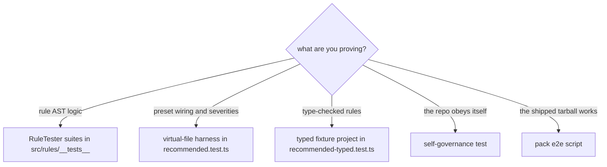
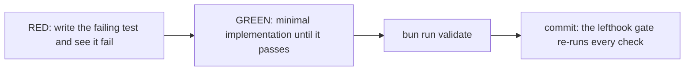

# Testing — Four Harnesses, Each Proving One Thing

**The answer first**: `bun run validate` runs everything (typecheck + vitest). Four distinct harnesses exist because each can prove something the others cannot. Pick by what you need to prove:



## The harnesses

| Harness | Runs | Can prove | Cannot prove |
|---------|------|-----------|--------------|
| **RuleTester** (`src/rules/__tests__/*.test.ts`) | Rule module in isolation, RED/GREEN cases | AST logic, messages, options | Glob wiring, severity in the preset |
| **Virtual-file harness** (`src/configs/__tests__/recommended.test.ts`) | Real `ESLint` instance, `lintText` with virtual paths | Glob→role topology, severity policy, override behavior | **Anything needing type info** (see constraints) |
| **Typed fixture project** (`src/configs/__tests__/recommended-typed.test.ts` + `__fixtures__/typed-project/`) | Real `ESLint` with `cwd` at a fixture project on disk | Type-checked tier (`no-floating-promises` fires; clean files stay green) | — |
| **Self-governance** (`src/__tests__/self-governance.test.ts`) | Lints `src/**` with the universal subset of shipped rules + layer contract | The package passes its own architecture; import direction | React-layer rules (out of scope for this repo) |
| **Drift guards** (`src/configs/__tests__/upstream-severity-drift.test.ts`) | Compares runtime plugin severities to JSON contracts | Upstream error-sets haven't shifted | Behavior — pair with behavioral tests |
| **Pack e2e** (`scripts/pack-e2e.mjs`, `bun run e2e:pack`) | Packs tarball → installs into a fresh temp consumer → lints → runs CLI | Entry-point resolution, preset works from the real artifact, CLI scaffolds | — (slowest; the release gate) |

## Hard constraints — violate these and you'll chase ghosts

| Constraint | Detail |
|------------|--------|
| **Virtual files cannot exercise type-checked rules** | `lintText` files exist only in memory; no TypeScript program can include them. The virtual harness appends `virtualHarnessOverrides` which sets `projectService: false` and turns off every `typescriptTypeCheckedOnlyRules` entry. Typed behavior is proven ONLY in the typed fixture project |
| **Typed fixture files serve two masters** | Files under `__fixtures__/typed-project/src/` are compiled by BOTH the repo tsconfig (`strict`, `NodeNext`, `.ts` only) and the fixture's own tsconfig. Keep them self-contained (no cross-imports) and type-clean — a fixture must violate a LINT rule, never fail `tsc` |
| **Vitest only discovers `src/**/__tests__/**/*.test.ts`** | A debug test at repo root will silently not run ("No test files found") |
| **`npm pack` does NOT run `prepublishOnly`** | `pack-e2e` can validate a **stale** `dist/`. Always `bun run build` before `node scripts/pack-e2e.mjs` when verifying source changes end-to-end |
| **Fixture semantics are contracts** | Fixtures under `src/rules/__tests__/__fixtures__/**` encode what a test proves. Changing one changes the proof — treat as read-only unless the contract itself changes |
| **Test files must contain real tests** | `sonarjs/no-empty-test-file` runs in tests by design (an empty test file is a silently dead suite). Virtual test-file fixtures need a real `describe`/`it` |

## The virtual-file harness, precisely

```ts
// recommended.test.ts — the pattern
const config = [
  ...createRecommendedConfig({ /* options under test */ }),
  ...virtualHarnessOverrides,   // ← always append; see below
];
const [result] = await new ESLint({ overrideConfigFile: true, overrideConfig: config })
  .lintText(code, { filePath: 'src/features/x/thing.helpers.ts' });  // virtual path picks the role
```

`virtualHarnessOverrides` does three documented things: turns off `import-x/no-unresolved` (module resolution belongs to the consumer; this suite tests policy), pins the React version setting (no react install to detect), and disables the typed tier (no program for virtual files). Every severity decision EXCEPT the typed tier is exercised through this harness unchanged.

**Assert on rule IDs by severity**, not on counts alone:

```ts
const errorIds = result.messages.filter((m) => m.severity === 2).map((m) => m.ruleId);
expect(errorIds).toContain('dlinter/no-view-effects');     // fires as error
const warnIds = result.messages.filter((m) => m.severity === 1).map((m) => m.ruleId);
expect(warnIds).toContain('sonarjs/todo-tag');             // surgical downgrade holds
```

## TDD flow (mandatory)



A failure you never witnessed proves nothing: run the RED state before implementing. When a suite-wide change makes an existing green fixture fail, decide honestly — is the new verdict *correct* for real projects? Then fix the fixture (precedent: `no-empty-test-file`). Is it a misfire? Then it's a named surgical override with a reason ([severity-policy.md](./severity-policy.md)).

## Commands

```bash
bun run validate                                  # the full local gate
bunx vitest run src/configs/__tests__/            # config suites only
bunx vitest run src/rules/__tests__/x.test.ts     # one rule suite
bun run build && bun run e2e:pack                 # honest end-to-end (fresh dist!)
```
